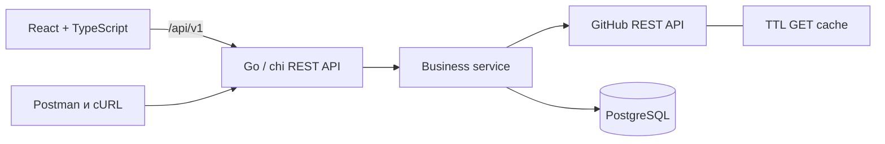

# RepoScope

**RepoScope** — сервис поиска и экспресс-оценки публичных GitHub-репозиториев. Он собирает разрозненные сигналы — активность, популярность, лицензию, языки, релизы, участников и issues — в одну понятную карточку и позволяет сохранить интересные проекты в PostgreSQL.

Проект создан для дисциплины «Интерфейс прикладного программирования» и закрывает три практические работы: публичный Web API, тестирование REST в Postman и запросы через cURL. При этом это не одноразовый лабораторный макет: backend имеет слои, контракт, тесты, middleware, graceful shutdown и CI; frontend — самостоятельный адаптивный интерфейс.

[English version](README.en.md) · [OpenAPI](docs/openapi.yaml) · [Архитектура](docs/architecture.md) · [Анализ REST](docs/api-analysis.md)

## Зачем нужен продукт

Поиск GitHub хорошо находит совпадения, но перед изучением или contribution разработчику приходится открывать несколько вкладок и вручную отвечать на вопросы: проект жив? есть лицензия? выходят релизы? на каких языках он написан? RepoScope сокращает это первичное исследование и показывает объяснимый **Repo Health Score 0–100** рядом с исходными метриками.

## Интерфейс поиска


## Возможности

- поиск публичных репозиториев с фильтром языка, сортировкой и пагинацией;
- карточка владельца, лицензии, stars, forks, open issues и даты активности;
- распределение языков, последние участники, releases и issues без pull requests;
- объяснимый Repo Health Score;
- избранное с защитой от дублей и хранением в PostgreSQL;
- отображение `core` и `search` rate limits GitHub;
- skeleton, empty/error states, клавиатурный focus и мобильная компоновка;
- единый JSON ошибок с request ID;
- OpenAPI 3.0, Postman Collection/Environment и cURL-сценарии для Bash/PowerShell.

## Архитектура



Backend следует направлению зависимостей `HTTP → service → ports → GitHub/PostgreSQL`. Composition root находится в `cmd/api`; интерфейсы добавлены только на границах, нужных тестам. Подробности и формула score — в [docs/architecture.md](docs/architecture.md).

## Стек

- Go 1.23.2, `net/http`, chi, `log/slog`;
- pgx v5 + PostgreSQL 17, параметризованный SQL;
- React, TypeScript, Vite, чистый CSS;
- Nginx, Docker multi-stage, Docker Compose;
- OpenAPI 3.0, Postman 2.1, cURL;
- GitHub Actions, golangci-lint.

## Быстрый запуск через Docker Compose

Требования: Docker Engine/Desktop с Compose v2.

```bash
cp .env.example .env       # PowerShell: Copy-Item .env.example .env
docker compose up --build -d
docker compose ps
```

Откройте:

- UI — <http://localhost:3000>;
- API health — <http://localhost:8081/api/v1/health>;
- OpenAPI внутри web-контейнера — <http://localhost:3000/docs/openapi.yaml>.

Таблица `favorites` создаётся idempotent-миграцией при старте API. Остановить: `docker compose down`; удалить также локальный volume БД: `docker compose down -v` (данные будут потеряны).

## Настройка `.env`

| Переменная | Default | Назначение |
|---|---|---|
| `DATABASE_URL` | локальный `reposcope` | DSN PostgreSQL |
| `GITHUB_TOKEN` | пусто | необязательный fine-grained/classic token только для чтения публичных данных |
| `GITHUB_API_VERSION` | `2026-03-10` | версия GitHub REST API |
| `GITHUB_API_URL` | `https://api.github.com` | меняется на mock только в тестовой среде |
| `CORS_ALLOWED_ORIGINS` | localhost 3000/5173 | список origins через запятую |
| `HTTP_CLIENT_TIMEOUT` | `12s` | timeout GitHub-клиента |
| `CACHE_TTL` | `2m` | срок in-memory GET-кэша; `0s` отключает |
| `SHUTDOWN_TIMEOUT` | `10s` | лимит graceful shutdown |

Никогда не помещайте настоящий токен в исходники, Dockerfile, Compose или screenshot. `.env` игнорируется Git. Для production используйте secret manager и отдельного пользователя БД.

## Локальная разработка

Требования: Go 1.23.2, Node.js 24+, npm 11+, PostgreSQL 15+.

```bash
cp .env.example .env
# Измените DATABASE_URL: host db -> localhost
go mod download
go run ./cmd/api
```

В другом терминале:

```bash
cd web
npm ci
npm run dev
```

Vite проксирует `/api` на `localhost:8080`. Для одной PostgreSQL без остальных сервисов: `docker compose up -d db`.

## Команды качества

```bash
make fmt              # gofmt
make test             # go test ./...
make test-race        # race detector; нужен CGO toolchain
make test-cover       # HTML coverage
make build            # backend + frontend
make lint             # golangci-lint + TypeScript/Vite build
make compose-check    # валидация Compose
```

Прямые эквиваленты для Windows без `make`:

```powershell
gofmt -w cmd internal
go test ./...
go build ./cmd/api
Set-Location web; npm ci; npm run build
```

Тесты не расходуют GitHub rate limit: `internal/github` использует `httptest.Server`, HTTP handlers — fake ports. Реальная сеть нужна только работающему приложению и ручным практическим сценариям.

## REST API

База: `http://localhost:8080/api/v1`.

| Метод | Endpoint | Назначение |
|---|---|---|
| GET | `/health` | liveness |
| GET | `/ready` | готовность PostgreSQL |
| GET | `/rate-limit` | buckets GitHub core/search |
| GET | `/repositories/search` | `q`, `language`, `sort`, `order`, `page`, `per_page` |
| GET | `/repositories/{owner}/{repo}` | детали + Health Score |
| GET | `…/languages` | байты по языкам |
| GET | `…/contributors` | участники с пагинацией |
| GET | `…/issues` | issues без PR |
| GET | `…/releases` | релизы с пагинацией |
| GET | `/favorites` | список избранного |
| POST | `/favorites` | JSON `{"owner":"golang","repo":"go"}` |
| DELETE | `/favorites/{owner}/{repo}` | удаление, `204` |

Полный контракт, схемы, параметры и ошибки: [docs/openapi.yaml](docs/openapi.yaml).

```json
{
  "error": {
    "code": "validation_error",
    "message": "Поля запроса не прошли валидацию",
    "request_id": "m1abc-1",
    "details": {"owner": "длина должна быть от 1 до 100 символов"}
  }
}
```

## Postman

1. Импортируйте [коллекцию](postman/RepoScope.postman_collection.json) и [environment](postman/RepoScope.postman_environment.json).
2. Выберите **RepoScope Local**.
3. Запустите всю коллекцию по порядку через Collection Runner.

Сценарий проверяет `200/201/204/400/404/409/422`, Content-Type, JSON-структуру, `Location`, сохранение переменных и lifecycle избранного. Полный отчёт: [практическая № 2](docs/practical-2-postman-rest.md).

Для CLI-runner можно установить Newman отдельно и выполнить:

```bash
npx newman run postman/RepoScope.postman_collection.json \
  -e postman/RepoScope.postman_environment.json
```

## cURL

```bash
bash scripts/curl-demo.sh
```

```powershell
.\scripts\curl-demo.ps1
```

PowerShell-сценарий использует именно `curl.exe`. Подробности: [практическая № 3](docs/practical-3-curl.md) и [cheatsheet](docs/curl-cheatsheet.md).

## GitHub API и ограничения

Приложение обращается к официальному `https://api.github.com`, передавая `Accept`, `User-Agent` и `X-GitHub-Api-Version`. Без токена доступны публичные данные с primary limit 60 запросов/час на IP; с пользовательским токеном типичный core limit — 5000/час. Search имеет отдельный, более строгий bucket. GitHub может ответить `403` или `429`; RepoScope нормализует их в `429 github_rate_limited` и не делает агрессивных повторов. Официальные источники: [rate limits](https://docs.github.com/en/rest/using-the-rest-api/rate-limits-for-the-rest-api), [API versions](https://docs.github.com/en/rest/about-the-rest-api/api-versions).

Результаты поиска GitHub доступны максимум примерно в пределах первых 1000 элементов. Счётчики, релизы и список участников динамичны; документация не фиксирует их как неизменяемый результат.

## Структура проекта

```text
cmd/api/                 запуск и lifecycle
internal/config/         переменные окружения
internal/github/         внешний API, cache, tests
internal/httpapi/        router, handlers, middleware, tests
internal/model/          модели/DTO
internal/repository/     PostgreSQL favorites
internal/service/        use cases и Health Score
migrations/              SQL up/down
web/                     React + TypeScript + CSS + Nginx
docs/                    OpenAPI, архитектура, отчёты
postman/                 Collection + Environment
scripts/                 Bash и PowerShell cURL demos
.github/workflows/       CI
```

## Архитектурные решения

- **Собственный backend вместо прямого GitHub из браузера:** токен остаётся секретом, ошибки и DTO стабильны.
- **chi поверх `net/http`:** удобные path-параметры при сохранении стандартных handler/middleware.
- **pgx без ORM:** SQL виден, типобезопасное сканирование и параметризация легко обсуждаются на собеседовании.
- **Короткий in-memory cache:** экономит rate limit без инфраструктуры Redis; подходит одному процессу.
- **Параллельные detail-запросы во frontend:** части карточки независимы, API остаётся ресурсным.
- **Неагрессивная retry-политика:** повтор при secondary limit может усугубить блокировку; клиент получает честный 429.

## Материалы практических работ

1. [Публичный Web API](docs/practical-1-public-web-api.md)
2. [Postman и анализ REST](docs/practical-2-postman-rest.md)
3. [cURL](docs/practical-3-curl.md)

## Дальнейшее развитие

- аутентификация и персональное избранное;
- Redis и conditional requests с ETag;
- графики commit/release cadence и bus factor;
- фоновая история score вместо снимка на запрос;
- cursor-based пагинация там, где её даёт upstream;
- e2e-тесты UI и контрактная проверка OpenAPI в CI;
- deploy с TLS, managed PostgreSQL и observability.

## Что проект демонстрирует работодателю

Практическую интеграцию с внешним API; понимание HTTP/REST и кодов состояния; Go concurrency/cancellation и lifecycle сервера; проектирование границ и тестируемых зависимостей; PostgreSQL и race-safe уникальность; безопасную работу с секретами; умение собрать доступный UI и оформить воспроизводимые DevEx/QA-артефакты.

## Лицензия

[MIT](LICENSE).
