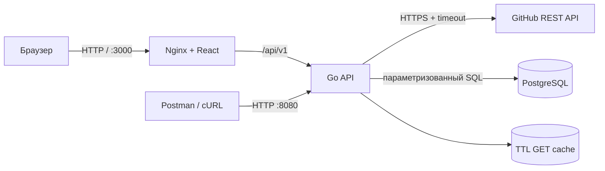

# Архитектура RepoScope

## Контекст и границы

RepoScope — stateless HTTP-приложение, которое читает публичные данные GitHub и хранит только пользовательский список избранного. GitHub-токен известен исключительно backend. Браузер общается с собственным API и не получает ни токен, ни прямой доступ к PostgreSQL.

## Слои

- `cmd/api` — composition root: конфигурация, соединения, передача зависимостей, HTTP-сервер и graceful shutdown.
- `internal/httpapi` — маршрутизация, DTO на границе, валидация, JSON, преобразование ошибок и middleware.
- `internal/service` — сценарии приложения и Repo Health Score. Слой не зависит от HTTP.
- `internal/github` — типизированный клиент внешнего API, обязательные заголовки, timeout, контекст, обработка статусов и TTL-кэш.
- `internal/repository` — параметризованные запросы PostgreSQL и преобразование уникального ограничения в доменную ошибку.
- `internal/model` — данные, которыми обмениваются слои.
- `web` — отдельный SPA-клиент; в production Nginx проксирует `/api`.

Зависимости создаются в `main` и передаются явно. Интерфейсы определены около потребителя (`service`) и позволяют интеграционным HTTP-тестам работать с предсказуемыми fake-реализациями без сети и базы. Глобального изменяемого состояния нет; счётчик request ID атомарный и не содержит бизнес-данных.

## Поток запроса

1. Middleware создаёт/принимает `X-Request-ID`, ставит CORS/security headers, восстанавливается после panic и пишет структурированный лог.
2. Handler валидирует path/query/body. Некорректный JSON даёт `400`, семантически неверные поля — `422`.
3. Service вызывает GitHub-клиент и/или хранилище.
4. GitHub-клиент наследует отмену из `request.Context()`, ограничен client timeout и кэширует успешный GET на две минуты.
5. Ошибки переводятся в единый JSON. GitHub `403/429` становится `429`, чтобы клиент понимал временный характер ограничения.

## Repo Health Score

Оценка 0–100 — объяснимый эвристический индикатор, не объективная мера качества:

- популярность по логарифмической шкале: звёзды до 25, форки до 15;
- лицензия — 15;
- неархивный статус — 10;
- описание — 5, topics — 5;
- свежесть последнего push: до 25 (≤30 дней), 18 (≤180), 10 (≤365).

Пороговые подписи: 75–100 «активный», 50–74 «стабильный», ниже 50 «требует внимания». Логарифм не позволяет гигантским проектам полностью подавить небольшие. В интерфейсе score показан рядом с исходными показателями, чтобы пользователь мог сделать собственный вывод.

## Надёжность и безопасность

- `GITHUB_TOKEN` необязателен, читается из среды и не попадает в ответы/логи/образ.
- SQL использует `$1…$n`; имена таблиц не строятся из пользовательского ввода.
- Тело ограничено 1 MiB, неизвестные JSON-поля запрещены.
- HTTP client/server имеют timeout; shutdown ограничен отдельным timeout.
- Readiness проверяет PostgreSQL, liveness не зависит от внешней сети.
- Кэш не содержит приватных данных: приложение работает только с публичными репозиториями.
- Уникальный case-insensitive индекс обеспечивает защиту от дублей даже при гонке двух POST.

## Осознанные компромиссы

Миграция продублирована как запускаемая идемпотентная DDL в Go и как up/down SQL для учебной прозрачности. Для большой системы следует подключить версионируемый migration runner и выполнять его отдельной release-задачей. In-memory кэш локален одному процессу; горизонтальное масштабирование потребует Redis. Пользовательской аутентификации нет — это демонстрационный single-tenant сервис, поэтому избранное общее.

